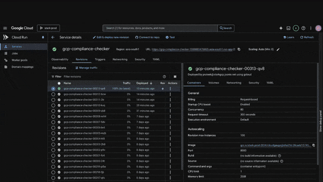
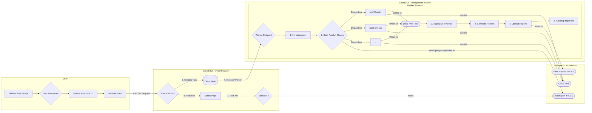

[](LICENSE)

# **CloudGauge**

**Note:** This is not an officially supported Google product. This project is not eligible for the [Google Open Source Software Vulnerability Rewards Program](https://bughunters.google.com/open-source-security).

CloudGauge is a web application designed to run a comprehensive set of compliance, security, cost optimization, and best-practice checks against a Google Cloud Organization.

It is built with Python/Flask and deployed as a serverless application on **Google Cloud Run**. The application leverages **Cloud Tasks** to run scans asynchronously, ensuring that even very large organizations can be scanned without browser timeouts.

Final results are delivered as an interactive **HTML report** and a **CSV file** stored in a Google Cloud Storage bucket. The reports also feature **Gemini-powered** executive summaries and `gCloud` remediation suggestions.



## **Table of Contents**

* [Features](#features)
* [Architecture](#architecture)
* [Deployment Instructions](#deployment-instructions)
  * [Common Prerequisites (Required for all methods)](#common-prerequisites-required-for-all-methods)
  * [Method 1: Deploy from Source (Recommended)](#method-1-deploy-from-source-recommended)
  * [Method 2: Manual Build & Deploy via gcloud](#method-2-manual-build--deploy-via-gcloud)
* [How to Use](#how-to-use)
* [Troubleshooting](#troubleshooting)
* [Cleanup Script](#cleanup-script)
* [License & Support](#license--support)

## **Features**

CloudGauge scans your organization across several key domains, modeled after the Google Cloud Architecture Framework.

### **Security & Identity**

* **Organization Policies**: Checks boolean policies against a list of best practices.
* **Organization IAM**: Scans for public principals (`allUsers`, `allAuthenticatedUsers`) and primitive roles (`owner`, `orgAdmin`) at the org level.
* **Project IAM**: Scans all projects for the use of primitive `roles/owner` and `roles/editor`.
* **Security Command Center**: Verifies that SCC Premium is enabled.
* **SA Key Rotation**: Finds user-managed service account keys older than 90 days.
* **Public GCS Buckets**: Detects GCS buckets that are publicly accessible.
* **Open Firewall Rules**: Scans all VPCs for firewall rules open to the internet (`0.0.0.0/0`).

### **Cost Optimization**

* **Idle Resources**: Finds idle Cloud SQL instances, VMs, persistent disks, and unassociated IP addresses.
* **Rightsizing**: Identifies overprovisioned VMs and underutilized reservations.
* **Cost Insights**: Provides an on-demand, detailed scan for CPU/memory usage, idle images, and more.

### **Reliability & Resilience**

* **Essential Contacts**: Ensures contacts are configured for `SECURITY`, `TECHNICAL`, and `LEGAL` categories.
* **Service Health**: Verifies that the Personalized Service Health API is enabled.
* **Cloud SQL Resilience**: Checks for High Availability (HA) configuration, automated backups, and Point-in-Time Recovery (PITR).
* **GCS Versioning**: Finds buckets without object versioning enabled.
* **GKE Hygiene**: Checks for clusters not on a release channel and node pools with auto-upgrade disabled.
* **Resilience Assets**: Identifies zonal MIGs (recommends regional) and single-region disk snapshots.

### **Operational Excellence & Observability**

* **Audit Logging**: Checks for an organization-level log sink.
* **OS Config Coverage**: Identifies running VMs (excluding GKE/Dataproc) that are not reporting to the OS Config service.
* **Monitoring Coverage**: Scans for projects missing key alert policies (e.g., Quota, Cloud SQL, GKE).
* **Network Analyzer**: Ingests and normalizes insights for VPC, GKE, and PSA IP address utilization.
* **Standalone VMs**: Finds VMs not managed by a Managed Instance Group (MIG).
* **Quota Utilization**: Identifies any regional compute quotas exceeding 80% utilization.
* **Unattended Projects**: Flags projects with low utilization.

##  **Architecture**

The application follows a robust, scalable, and asynchronous "fire-and-forget" pattern. This ensures the user gets an immediate response while the heavy work (which can take many minutes) is done in the background.

1.  **UI Trigger**: A user navigates to the Cloud Run URL and submits an Organization ID.
2.  **Task Creation**: The `/scan` endpoint creates a **Cloud Task** with the scan details and redirects the user to a status page.
3.  **Background Worker**: Cloud Tasks securely invokes the `/run-scan` endpoint in the background.
4.  **Parallel Processing**: The worker executes dozens of checks, running project-level scans in parallel using a thread pool.
5.  **Report Storage**: The worker generates the HTML/CSV reports and uploads them to Google Cloud Storage.
6.  **Status Polling**: The user's status page polls an API endpoint until the report files are found in GCS, at which point it displays the download links.

### **Architecture Diagram**

The diagram below illustrates the asynchronous "fire-and-forget" pattern.



## **Deployment Instructions** 

Follow the **Common Prerequisites** first, then choose **Method 1** or **Method 2** to deploy.

### **Common Prerequisites (Required for all methods)** 

1. **Enable APIs**:  
   * A Google Cloud Project with billing enabled.  
   * [gcloud CLI](https://cloud.google.com/sdk/install) installed and authenticated (`gcloud auth login`).  
   * Run the following command to enable all necessary APIs:

   ```
   gcloud services enable \
       run.googleapis.com \
       cloudbuild.googleapis.com \
       cloudtasks.googleapis.com \
       iam.googleapis.com \
       cloudresourcemanager.googleapis.com \
       logging.googleapis.com \
       recommender.googleapis.com \
       securitycenter.googleapis.com \
       servicehealth.googleapis.com \
       essentialcontacts.googleapis.com \
       compute.googleapis.com \
       container.googleapis.com \
       sqladmin.googleapis.com \
       osconfig.googleapis.com \
       monitoring.googleapis.com \
       storage.googleapis.com \
       aiplatform.googleapis.com \
       cloudasset.googleapis.com
   ```
   

2. **Create Service Account & Grant Permissions**:  
   * This SA will be used by the Cloud Run service to scan the organization and create tasks.
```
   # Set your Organization ID
   export ORG_ID="<your-org-id>"

   

   # Set Project and SA variables

   export PROJECT_ID=$(gcloud config get-value project)
   export SA_NAME="cloudgauge-sa"
   export SA_EMAIL="${SA_NAME}@${PROJECT_ID}.iam.gserviceaccount.com"

   

   # Create the Service Account

   gcloud iam service-accounts create ${SA_NAME} --display-name="CloudGauge Service Account"

   

   #  Grant Permissions 

   

   # 1. Grant ORG-level roles to read assets and policies

   gcloud organizations add-iam-policy-binding ${ORG_ID} --member="serviceAccount:${SA_EMAIL}" --role="roles/browser"

   gcloud organizations add-iam-policy-binding ${ORG_ID} --member="serviceAccount:${SA_EMAIL}" --role="roles/cloudasset.viewer"

   gcloud organizations add-iam-policy-binding ${ORG_ID} --member="serviceAccount:${SA_EMAIL}" --role="roles/compute.networkViewer"

   gcloud organizations add-iam-policy-binding ${ORG_ID} --member="serviceAccount:${SA_EMAIL}" --role="roles/essentialcontacts.viewer"

   gcloud organizations add-iam-policy-binding ${ORG_ID} --member="serviceAccount:${SA_EMAIL}" --role="roles/recommender.iamViewer"

   gcloud organizations add-iam-policy-binding ${ORG_ID} --member="serviceAccount:${SA_EMAIL}" --role="roles/logging.viewer"

   gcloud organizations add-iam-policy-binding ${ORG_ID} --member="serviceAccount:${SA_EMAIL}" --role="roles/monitoring.viewer"

   gcloud organizations add-iam-policy-binding ${ORG_ID} --member="serviceAccount:${SA_EMAIL}" --role="roles/orgpolicy.policyViewer"

   gcloud organizations add-iam-policy-binding ${ORG_ID} --member="serviceAccount:${SA_EMAIL}" --role="roles/resourcemanager.organizationViewer"

   gcloud organizations add-iam-policy-binding ${ORG_ID} --member="serviceAccount:${SA_EMAIL}" --role="roles/servicehealth.viewer"

   gcloud organizations add-iam-policy-binding ${ORG_ID} --member="serviceAccount:${SA_EMAIL}" --role="roles/securitycenter.settingsViewer"

   gcloud organizations add-iam-policy-binding ${ORG_ID} --member="serviceAccount:${SA_EMAIL}" --role="roles/iam.securityReviewer"

   

   

   # 2. Grant PROJECT-level roles (on the project where Cloud Run is deployed)

   gcloud projects add-iam-policy-binding ${PROJECT_ID} --member="serviceAccount:${SA_EMAIL}" --role="roles/aiplatform.user"

   gcloud projects add-iam-policy-binding ${PROJECT_ID} --member="serviceAccount:${SA_EMAIL}" --role="roles/cloudtasks.admin"

   

   # 3. Service Account Token Creator and User role to the SA itself for signed URLs

   gcloud iam service-accounts add-iam-policy-binding ${SA_EMAIL} --member="serviceAccount:${SA_EMAIL}"  --role="roles/iam.serviceAccountTokenCreator" 

   gcloud iam service-accounts add-iam-policy-binding ${SA_EMAIL} --member="serviceAccount:${SA_EMAIL}"  --role="roles/iam.serviceAccountUser"
```
3. **Create GCS Bucket**:
```
export BUCKET_NAME="cloudgauge-reports-${PROJECT_ID}"

gsutil mb -p ${PROJECT_ID} gs://${BUCKET_NAME}

gcloud storage buckets add-iam-policy-binding gs://${BUCKET_NAME} --member="serviceAccount:${SA_EMAIL}" --role="roles/storage.objectAdmin"
```
---

### 

### **Method 1: Deploy from Source (Recommended)** 

### **Step 1: Fork the GitHub Repository** 

First, you need your own copy of the code.

1. Navigate to the [CloudGauge GitHub repository](https://github.com/GoogleCloudPlatform/CloudGauge/).  
2. Click the **Fork** button in the top-right corner of the page.  
3. Choose your GitHub account as the destination for the fork. This will create a copy of the repository under your account (e.g., `https://github.com/your-username/CloudGauge`).

---

### **Step 2: Create the Cloud Run Service (First Deployment)** 

Now, let's create the initial Cloud Run service and connect it to your new repository.

1. In the Google Cloud Console, go to the **Cloud Run** page.  
2. Click **Create Service**.  
3. Select **Continuously deploy new revisions from a source repository** and click **Set up with Cloud Build**.  
4. A new panel will appear. In the "Source" section, under "Repository", click **Manage connected repositories**.  
5. A new window will pop up, prompting you to **install the Google Cloud Build app** on GitHub.  
   * Select your GitHub username or organization.  
   * In the "Repository access" section, choose either **All repositories** or **Only select repositories**. If you choose the latter, make sure you select your forked `CloudGauge` repository.  
   * Click **Install** or **Save**.  
6. Back in the Cloud Console, select your newly connected forked repository and branch (`main`), then click **Next**.  
7. In the **Build Settings** section:  
   * **Build Type**: Select `Dockerfile`.  
   * **Source location**: Keep the default `/Dockerfile`.  
   * Click **Save**.  
8. Configure the service details:  
   * **Service name**: Give it a name like `cloudgauge-service`.  
   * **Region**: Choose a region, for example, `asia-south1`.  
9. Expand the "Container(s), Volumes, Networking, Security" section.  
   * Go to the **Identity & Security** tab and select the service account you previously created (e.g., `cloudgauge-sa@...`).  
   * Go to the **General** tab and set the **Request Timeout** to `3600` seconds.  
   * Go to the **Variables & Secrets** tab and add the following **Environment Variables**. Replace the example values with your own.  
     * `PROJECT_ID`: Your GCP Project ID (e.g., `my-gcp-project`)  
     * `TASK_QUEUE`: `cloudgauge-scan-queue`  
     * `RESULTS_BUCKET`: The name of your GCS bucket (e.g., `cloudgauge-reports-my-gcp-project`)  
     * `SERVICE_ACCOUNT_EMAIL`: The full email of your service account  
     * `LOCATION`: The region you selected (e.g., `asia-south1`)  
10. Click **Create**. The service will start building and deploying.

---

### **Step 3: Grant Required IAM Roles** 

The service account needs two key permissions to function correctly. You can grant these permissions after the first deployment is complete.

**Cloud Run Invoker (roles/run.invoker)**: This role is required to allow the Cloud Tasks service to securely trigger your CloudGauge service to start a scan. This permission is granted specifically on the new Cloud Run service you just deployed.

**Cloud Run Viewer (roles/run.viewer)**: This role allows the service to automatically discover its own public URL when it starts up. This feature enables a single-step deployment, removing the need to manually update the service with its own URL. This permission is granted at the service level.

By granting both roles at the service level, you ensure the service account only has the minimum permissions required on the specific resource it needs to access.

1. Once the service is created, find its URL on the Cloud Run details page.  
2. Open the **Cloud Shell** or your local terminal with `gcloud` configured.  
3. Run the following command, replacing the placeholders with your actual service name, service account email, and region.

```
# Store your service account email in a variable for convenience  
SA_EMAIL="cloudgauge-sa@your-project-id.iam.gserviceaccount.com"
SERVICE_NAME="your-chosen-service-name"
export REGION="asia-south1" # Or your chosen region

# Grants permission to be invoked by Cloud Tasks
gcloud run services add-iam-policy-binding ${SERVICE_NAME} --member="serviceAccount:${SA_EMAIL}" --role="roles/run.invoker" --region=${REGION}

# Grants permission to view its own service details to find its URL
gcloud run services add-iam-policy-binding ${SERVICE_NAME} --member="serviceAccount:${SA_EMAIL}" --role="roles/run.viewer" --region=${REGION}

```
With these permissions set, your CloudGauge instance is fully deployed and ready to use. You can now proceed to the application's URL to start your first scan.

---

### **Method 2: Manual Build & Deploy via gcloud** 

This method gives you manual control over the build and deploy steps.

1. **Clone this repository**:
```
git clone https://github.com/GoogleCloudPlatform/CloudGauge
cd cloudgauge
```
2. **Set Environment Variables**:  
   * (You should already have `PROJECT_ID` and `SA_EMAIL` from the common setup)
```
     export REGION="asia-south1" # Or your preferred region  
     export SERVICE_NAME="cloudgauge-service"  
     export BUCKET_NAME="cloudgauge-reports-${PROJECT_ID}"  
     export QUEUE_NAME="cloudgauge-scan-queue"
```   

3. **Build and Deploy Service **:
   * This command builds the container and deploys it.
```
# Build the container image using Cloud Build  
gcloud builds submit . --tag "gcr.io/${PROJECT_ID}/${SERVICE_NAME}" --region=${REGION}

# Deploy to Cloud Run  
gcloud run deploy ${SERVICE_NAME} \
  --image "gcr.io/${PROJECT_ID}/${SERVICE_NAME}" \
  --service-account ${SA_EMAIL} \
  --region ${REGION} \
  --allow-unauthenticated \
  --platform managed \
  --timeout=3600 \
  --memory=1Gi \
  --set-env-vars=PROJECT_ID=${PROJECT_ID},TASK_QUEUE=${QUEUE_NAME},RESULTS_BUCKET=${BUCKET_NAME},SERVICE_ACCOUNT_EMAIL=${SA_EMAIL},LOCATION=${REGION}
```
4. **Grant Invoker & Viewer Permission**:  
   * Now that the service exists, give its SA permission to invoke it.
```
gcloud run services add-iam-policy-binding ${SERVICE_NAME} \
  --member="serviceAccount:${SA_EMAIL}" \
  --role="roles/run.invoker" \
  --region=${REGION}

gcloud run services add-iam-policy-binding ${SERVICE_NAME} \
  --member="serviceAccount:${SA_EMAIL}" \
  --role="roles/run.viewer" \
  --region=${REGION}
```

Your service is now fully deployed and configured\!

## **How to Use** 

1. Navigate to your service's URL (`${SERVICE_URL}`).  
2. Select your Scope from Dropdown menu : Organization, Folder or Project
3. Select the resource from the Dropdown
4. Click "Start Scan".  
5. You will be redirected to a status page. Wait for the scan to complete (this can take 5-15 minutes depending on org size).  
6. Once finished, links to the **Interactive HTML Report** and **Download CSV Report** will appear.

## **Troubleshooting**

If the status page is stuck for a long time, the background worker is likely failing.

### **Step 1: Check the Cloud Run Logs**

1. Go to the **Cloud Run** page in the Google Cloud Console.  
2. Click on your service (`cloudgauge-service`).  
3. Go to the **LOGS** tab.  
4. Look for log entries for requests made to the `/run-scan` URL.  
5. If you see logs for `/run-scan`, look for any errors in red.

### **Step 2: Check the Cloud Tasks Logs**

1. Go to the **Cloud Tasks** page in the Google Cloud Console.  
2. Click on your queue (`cloudgauge-scan-queue`).  
3. Go to the **LOGS** tab.  
4. Look at the status of the task attempts. If you see a `PERMISSION_DENIED` (HTTP 403\) error, it means you missed the **"Grant Invoker Permission"** step.

### **Step 3: Resolve Common Errors**

#### **Memory Limit Exceeded**

* **Error Message**: You might see an error in the Cloud Run logs that says: “`Memory limit of 512 MiB exceeded …”`  
* **Cause**: The scan process is using more memory than the default amount allocated to the Cloud Run service.  
* **Solution**: You need to increase the memory allocated to your service.  
  * **Via Console**:  
    1. Click **"Edit & Deploy New Revision"** on your Cloud Run service page.  
    2. Under the "General" tab, find **"Memory allocation"** and increase it (e.g., to `2 GiB`).  
    3. Click **Deploy**.  
  * **Via gcloud CLI**:

```
gcloud run services update cloudgauge-service \
  --memory=2Gi \
  --region=<your-region>
```
    
---

#### **Permission Denied on Google Cloud APIs**

* **Error Message**: The logs show a `PERMISSION_DENIED` error related to a specific Google Cloud service, such as `storage.googleapis.com` or `iam.googleapis.com`.  
* **Cause**: The service account (`cloudgauge-sa@...`) is missing an IAM role needed to access a specific API.  
* **Solution**: The error message will usually state which permission is missing. Go back to the **"Common Prerequisites"** section of the deployment instructions and verify that all `gcloud ... add-iam-policy-binding` commands were run successfully against the correct service account. You may need to re-run the command for the missing role.

---

#### **Container Failed to Start**

* **Error Message**: The Cloud Run revision is not becoming healthy, and the logs show an error right at startup, such as `ModuleNotFoundError` in Python or an error about a missing environment variable.  
* **Cause**: This typically happens for one of two reasons:  
  1. An environment variable was not set correctly.  
  2. There is a bug in the application code or a missing dependency in `requirements.txt`.  
* **Solution**:  
  1. Check the **LOGS** tab for the specific error message that occurs when the container tries to start.  
  2. If the error is related to a variable, click **"Edit & Deploy New Revision,"** go to the **"Variables & Secrets"** tab, and ensure all required variables (`PROJECT_ID`, `WORKER_URL`, etc.) are present and have the correct values.  
  3. If it is a code error, you will need to fix the source code and deploy a new revision.

---

#### **Request Timeout**

* **Error Message**: The logs show an HTTP `504` status code or a message like "The request has been terminated because it has reached its deadline."  
* **Cause**: The scan is taking longer to complete than the configured request timeout on the Cloud Run service.  
* **Solution**: The deployment instructions recommend a timeout of `3600` seconds (1 hour). Verify this was set correctly.  
  * **Via Console**: Go to **"Edit & Deploy New Revision"** and check the **"Request timeout"** value under the "General" tab.  
  * **Via gcloud CLI**: You can update the service with the correct timeout using:

```
gcloud run services update cloudgauge-service \
  --timeout=3600 \
  --region=<your-region>
```
---

#### **Builds Fail in a VPC Service Controls Environment**

* **Symptom:** When running a Cloud Build, the process fails during steps that require fetching external packages (e.g., `pip install`, `apt-get update`, or `npm install`). You may see timeout errors or messages related to network connectivity and egress being blocked.  
* **Cause:** By default, Cloud Build runs on workers in a Google-managed project that is outside your organization's VPC Service Controls (VPC SC) perimeter. Your perimeter is correctly blocking egress traffic from these external workers, preventing them from accessing public repositories to download dependencies.  
* **Solution:** Use **Cloud Build private pools**. This provisions dedicated build workers that run *inside* your own VPC network, making all build traffic internal and compliant with your security perimeter.  
    
  **1\. Create a Private Pool in Your VPC:** First, create a private worker pool connected to your VPC network. This ensures all build steps are executed within your perimeter.
```
gcloud builds worker-pools create [POOL_NAME] \
    --project=[PROJECT_ID] \
    --region=[REGION] \
    --peered-network=projects/[PROJECT_ID]/global/networks/[VPC_NETWORK]
```
  *Replace `[POOL_NAME]`, `[PROJECT_ID]`, `[REGION]`, and `[VPC_NETWORK]` with your specific values.*  

  
    
  **2\. Configure a Secure Egress Route for the Private Pool**

A private pool inside a VPC SC perimeter cannot access public package repositories by default. You need to provide a route to the internet.

**Note:** **Cloud NAT will not work for this use case.** Private pools reside in a separate, Google-managed VPC peered to yours. Cloud NAT does not provide service across a VPC peering connection.

The recommended solution is to use a **dedicated Compute Engine VM as a secure NAT Gateway**.

1. **Create a NAT Gateway VM:** Provision a small Compute Engine VM within your VPC. This VM should have an external IP address and be configured to perform network address translation (masquerading). You can use a startup script to enable IP forwarding and set the necessary iptables rules.  
2. **Create Custom Routes:** You must create custom routes to direct traffic from your private pool's IP range to the NAT gateway VM. This ensures only the build workers' traffic is routed for external access, leaving other resources unaffected.  
3. **Configure Firewall Rules:** Create VPC firewall rules to:  
   * Allow **ingress** traffic from the private pool's IP range to the NAT gateway VM.  
   * Allow **egress** traffic from the NAT gateway VM to the internet (0.0.0.0/0).
    
  **3\. Run Your Build Using the Private Pool:** Modify your `gcloud builds submit` command to include the `--worker-pool` flag, pointing it to your newly created private pool.

```
gcloud builds submit . \
  --tag "gcr.io/[PROJECT_ID]/[SERVICE_NAME]" \
  --region=[REGION] \
  --worker-pool=projects/[PROJECT_ID]/locations/[REGION]/workerPools/[POOL_NAME]
```

This command now directs Cloud Build to use a worker from your internal pool. The worker's traffic is routed through your secure NAT Gateway VM, allowing it to fetch external dependencies while remaining fully compliant with your VPC SC perimeter.

---

### **Forcing Image Storage to a Specific Region**

**Symptom:** You need to store your container images in a specific Google Cloud region (e.g., asia-south1 for organization policy resource location constraints), but by default, gcr.io hosts images in multi-regional locations (us, eu, asia) and does not offer specific regional control.

**Cause:** Google Container Registry (gcr.io) is a multi-regional service. To gain fine-grained control over the storage location of your images, you should use **Artifact Registry**, which is Google Cloud's recommended service for managing container images and language packages.

**Solution:** Create a Docker repository in Artifact Registry in your desired region and update your build commands to point to the new regional endpoint.


**Step 1: Create a Regional Artifact Registry Repository**

First, create a new Docker-format repository in your chosen region. This example uses asia-south1 (Mumbai).

```
gcloud artifacts repositories create cloudgauge-repo \ 
    --repository-format=docker \
    --location=asia-south1 \
    --description="CloudGauge Docker repository in Mumbai"
```

*You only need to run this command once to set up the repository.*


**Step 2: Update Your Build and Push Commands**

Next, you must change the image path in your build and push commands from gcr.io/... to the new Artifact Registry path. The new format is \[REGION\]-docker.pkg.dev/\[PROJECT\_ID\]/\[REPO\_NAME\]/\[IMAGE\_NAME\].

#### **Option A: Using Cloud Build**

If you're using Cloud Build, update the \--tag flag in your gcloud builds submit command:

```
gcloud builds submit . --tag "asia-south1-docker.pkg.dev/[PROJECT_ID]/cloudgauge-repo/[SERVICE_NAME]"
```

#### **Option B: Pushing a Local Image**

If you are building your image locally, update your docker tag and docker push commands:

\# 1\. Build the image 
```
docker build -t cloudgauge-image .
```
\# 2\. Tag the image for your new Artifact Registry repo 
```
docker tag cloudgauge-image asia-south1-docker.pkg.dev/[PROJECT_ID]/cloudgauge-repo/cloudgauge-image
```
\# 3\. Push the image  
```
docker push asia-south1-docker.pkg.dev/[PROJECT_ID]/cloudgauge-repo/cloudgauge-image
```
By following these steps, you can ensure your container images are stored and managed in the specific Google Cloud region that meets your requirements.

---

## **Cleanup Script**

This gCloud script will remove all the resources created by the tool. 

### **Configure Your Variables**

Before running the script, replace the placeholder values in the first few lines with the ones you used during deployment.

```
#!/bin/bash

# --- CONFIGURE THESE VARIABLES ---
export YOUR_ORG_ID="123456789012" # Replace with your Organization ID
export PROJECT_ID="your-gcp-project-id"   # Replace with your Project ID
export REGION="asia-south1"         # Replace with the region you deployed to
# --- END CONFIGURATION ---


# Set derived variables
export SERVICE_NAME="cloudgauge-service"
export QUEUE_NAME="cloudgauge-scan-queue"
export BUCKET_NAME="cloudgauge-reports-${PROJECT_ID}"
export SA_NAME="cloudgauge-sa"
export SA_EMAIL="${SA_NAME}@${PROJECT_ID}.iam.gserviceaccount.com"

# --- DELETION SCRIPT STARTS HERE ---

echo "--- Starting Cleanup for CloudGauge in project ${PROJECT_ID} ---"

# 1. Delete the Cloud Run service
echo "Deleting Cloud Run service: ${SERVICE_NAME}..."
gcloud run services delete ${SERVICE_NAME} --region=${REGION} --platform=managed --quiet

# 2. Delete the Cloud Tasks queue
echo "Deleting Cloud Tasks queue: ${QUEUE_NAME}..."
gcloud tasks queues delete ${QUEUE_NAME} --location=${REGION} --quiet

# 3. Delete the GCS bucket and all its contents
echo "Deleting GCS bucket: gs://${BUCKET_NAME}..."
gsutil -m rm -r "gs://${BUCKET_NAME}"

# 4. Delete the container image from GCR
echo "Deleting container image..."
gcloud container images delete "gcr.io/${PROJECT_ID}/${SERVICE_NAME}" --force-delete-tags --quiet

# 5. Remove all IAM policy bindings for the service account
echo "Removing IAM bindings for ${SA_EMAIL}..."

# Organization-level roles
gcloud organizations remove-iam-policy-binding ${YOUR_ORG_ID} --member="serviceAccount:${SA_EMAIL}" --role="roles/cloudresourcemanager.organizationViewer" --quiet
gcloud organizations remove-iam-policy-binding ${YOUR_ORG_ID} --member="serviceAccount:${SA_EMAIL}" --role="roles/iam.securityReviewer" --quiet
gcloud organizations remove-iam-policy-binding ${YOUR_ORG_ID} --member="serviceAccount:${SA_EMAIL}" --role="roles/recommender.organizationViewer" --quiet
gcloud organizations remove-iam-policy-binding ${YOUR_ORG_ID} --member="serviceAccount:${SA_EMAIL}" --role="roles/cloudasset.viewer" --quiet

# Project-level roles
gcloud projects remove-iam-policy-binding ${PROJECT_ID} --member="serviceAccount:${SA_EMAIL}" --role="roles/cloudtasks.admin" --quiet
gcloud projects remove-iam-policy-binding ${PROJECT_ID} --member="serviceAccount:${SA_EMAIL}" --role="roles/storage.objectAdmin" --quiet
gcloud projects remove-iam-policy-binding ${PROJECT_ID} --member="serviceAccount:${SA_EMAIL}" --role="roles/iam.serviceAccountTokenCreator" --quiet
gcloud projects remove-iam-policy-binding ${PROJECT_ID} --member="serviceAccount:${SA_EMAIL}" --role="roles/aiplatform.user" --quiet
gcloud projects remove-iam-policy-binding ${PROJECT_ID} --member="serviceAccount:${SA_EMAIL}" --role="roles/run.invoker" --quiet # This was added to the SA itself, but good to be explicit

# 6. Delete the Service Account
echo "Deleting service account: ${SA_EMAIL}..."
gcloud iam service-accounts delete ${SA_EMAIL} --quiet

echo "✅ Cleanup complete!"
```
---

### **Step-by-Step Explanation**

Here's a breakdown of what each command in the script does:

1. **Delete Cloud Run Service**: `gcloud run services delete`  
   * This removes the main web application itself, stopping it from running and incurring costs.  
2. **Delete Cloud Tasks Queue**: `gcloud tasks queues delete`  
   * Your script automatically creates a Cloud Tasks queue named `cloudgauge-scan-queue`. This command deletes that queue.  
3. **Delete GCS Bucket**: `gsutil -m rm -r`  
   * This command deletes the `cloudgauge-reports-...` bucket and all the HTML/CSV reports stored inside it. The `-m` flag helps it run faster if there are many report files.  
4. **Delete Container Image**: `gcloud container images delete`  
   * When you deployed the service, Cloud Build created a container image and stored it in Google Container Registry (GCR). This command deletes that stored image to keep your registry clean.  
5. **Remove IAM Bindings**: `gcloud ... remove-iam-policy-binding`  
   * This is a critical step. Before deleting the service account, you should remove all the permissions (roles) you granted it at both the **Organization** and **Project** levels. This prevents "ghost" principals from showing up in your IAM policies.  
6. **Delete Service Account**: `gcloud iam service-accounts delete`  
   * This is the final step. After removing its permissions, you can safely delete the `cloudgauge-sa` service account itself.


## **License & Support** 

This is not an officially supported Google product. This project is not eligible for the [Google Open Source Software Vulnerability Rewards Program](https://bughunters.google.com/open-source-security).

This project is licensed under the Apache 2.0 License. See the `LICENSE` file for details.

For issues or feature requests, please file an issue on the project's GitHub page.
